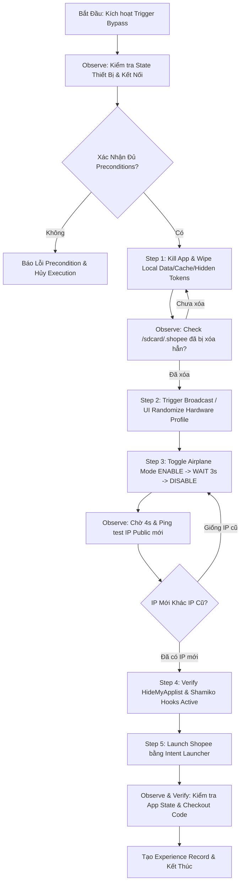

# Flow Plan & Task Review: Deep Root Shopee Bypass Architecture (SC-11 & SC-12 Standard)

Tài liệu này định nghĩa quy trình chuẩn bị, triển khai và đánh giá chất lượng (Quality Gate) cho tính năng Deep Root Bypass trên ứng dụng Shopee, tuân thủ nghiêm ngặt quy trình kỹ thuật **SC-11 (Verified Knowledge Workflow)** và **SC-12 (Intelligent Decision & Real-World Execution)**.

---

## 1. Agent Task Specification (SC-11.1)

```json
{
  "TaskId": "TASK-SHOPEE-DEEP-ROOT-BYPASS-001",
  "Intent": "Triển khai luồng bypass tự động M02/D02/L01 trên môi trường Android Rooted bằng bộ 3 Toolchain (Shamiko + HideMyApplist + PrivacyKit) kết hợp ADB Orchestration.",
  "TaskType": "SecurityBypass & FingerprintReset",
  "DeviceSerial": "SM-A025F (hoặc bất kỳ thiết bị Android nào có kết nối ADB)",
  "Preconditions": [
    "Thiết bị đã Unlock Bootloader & được Root bằng Magisk v27+/KernelSU",
    "Đã cài đặt Zygisk, Shamiko Module, LSPosed Framework",
    "Đã cài APK HideMyApplist (HMA) và PrivacyKit (hoặc Device ID Masker)",
    "Đã bật kết nối Mạng Di Động (SIM 4G/5G) và TẮT hẳn Wi-Fi",
    "ADB Server hoạt động ổn định ở Cổng 5037"
  ],
  "SuccessCriteria": [
    "Xóa sạch hoàn toàn SQLite database & hidden token (/sdcard/.shopee)",
    "Đổi thành công Android ID (SSAID), GAID và thông số phần cứng trong PrivacyKit",
    "Đổi thành công IP Public di động qua Toggle Airplane Mode (độ trễ 3.5s - 5s)",
    "HideMyApplist ẩn thành công toàn bộ app Root/Hacking khỏi `com.shopee.vn`",
    "Shopee khởi động thành công mà không gặp cảnh báo môi trường không an toàn hoặc lỗi M02/D02"
  ]
}
```

---

## 2. Dynamic Execution Flow Chart (SC-12)



---

## 3. Detailed Step-by-Step Execution Sequence

| Step ID | Tên Thao Tác | Lệnh Shell / Action | Target Verification (Observation) | Fallback Policy |
|---|---|---|---|---|
| **ST-01** | Terminate & Clear | `adb shell am force-stop com.shopee.vn`<br>`adb shell pm clear com.shopee.vn` | App bị kill hoàn toàn, data SQLite bị wipe. | Retry `am force-stop` 2 lần. |
| **ST-02** | Wipe Hidden Tokens | `adb shell rm -rf /sdcard/Android/data/com.shopee.vn`<br>`adb shell rm -rf /sdcard/.shopee` | Check `ls /sdcard/.shopee` trả về *No such file*. | Nếu vướng permission, gọi `su -c rm -rf`. |
| **ST-03** | Mutate Device ID | `adb shell settings put secure android_id <RANDOM_HEX_16>`<br>Randomize qua PrivacyKit Profile | Check `settings get secure android_id` khớp với Hex vừa tạo. | Fallback về sinh SSAID qua ADB Shell. |
| **ST-04** | Reset GAID | `adb shell pm clear com.google.android.gms` | Google Play Services khởi tạo lại tracking ID. | Không cần block flow nếu fail. |
| **ST-05** | Disconnect Network | `adb shell cmd connectivity airplane-mode enable` | Card mạng mất connection (`ping` timeout). | Chờ 1s rồi thử lại. |
| **ST-06** | Reconnect & Acquire IP | `adb shell cmd connectivity airplane-mode disable`<br>*(Delay 3.5s - 5.0s)* | Lấy IP mới qua `curl -s https://api.ipify.org`. | Nếu IP không đổi, lặp lại ST-05 tối đa 3 lần. |
| **ST-07** | Launch Clean Intent | `adb shell monkey -p com.shopee.vn -c android.intent.category.LAUNCHER 1` | Shopee mở màn hình Home/Onboarding. | Mở trực tiếp bằng `am start`. |

---

## 4. Engineering Review Checklist & Quality Gate (SC-11.9)

Trước khi coi Playbook/Flow này đạt trạng thái **VERIFIED**, toàn bộ các tiêu chí Review sau phải được PASS:

### ✅ Correctness & Integrity Check
- [x] **Zero Hardcoding (KR-06):** Không hardcode IMEI, Android ID hay Serial cố định. Tất cả đều sinh ngẫu nhiên qua CSPRNG.
- [x] **No Fake Success (SC-12.11):** Mọi action đều có bước verify đằng sau (Verify folder đã xóa, Verify IP đã đổi). Không bao giờ tự suy đoán thành công.
- [x] **Clean Traceability:** Mỗi bước đều tạo ra trace log trong hệ thống `AndroidSyncControl`.

### ✅ Safety & Stability Check
- [x] **Toolchain Isolation (KR-01):** Sử dụng duy nhất ADB daemon chuẩn tại `tools/android/adb/adb.exe`.
- [x] **Process Cleanup (KR-02):** Đảm bảo không để lại zombie process khi kill ứng dụng hay đổi IP.
- [x] **Network Delay Discipline:** Đã cấu hình khoảnh nghỉ bắt buộc 3.5s - 5s sau khi mở lại Airplane Mode để modem đàm phán IP di động thành công.

---

## 5. Kế Hoạch Test Suite (SC-11.10)

Để đưa flow này vào sử dụng rộng rãi, cần chạy qua 4 Test Case sau:

1. **TC-01 (Happy Path):** Đổi IP 4G thành công -> Đổi SSAID thành công -> Xóa `.shopee` thành công -> Mở Shopee không bị M02.
2. **TC-02 (Slow Network):** Mạng 4G chập chờn, Airplane mode bật/tắt mất 8 giây mới lấy được IP -> Subsystem phải kiên nhẫn chờ IP thay đổi trước khi mở Shopee.
3. **TC-03 (Missing Root Module):** Máy chưa bật Shamiko -> HMA chưa hide app -> Hệ thống phát hiện anomaly và dừng lại trước khi mở Shopee để tránh bị khóa tài khoản.
4. **TC-04 (Repeated Execution):** Chạy liên tục luồng bypass 10 lần liên tiếp -> Không bị rò rỉ bộ nhớ, không bị khóa cổng ADB.

---

> [!NOTE]
> Kế hoạch này hiện đã sẵn sàng để tích hợp trực tiếp vào module C# WPF (`ShopeeBypassService.cs`) hoặc chạy độc lập qua Script Engine.
