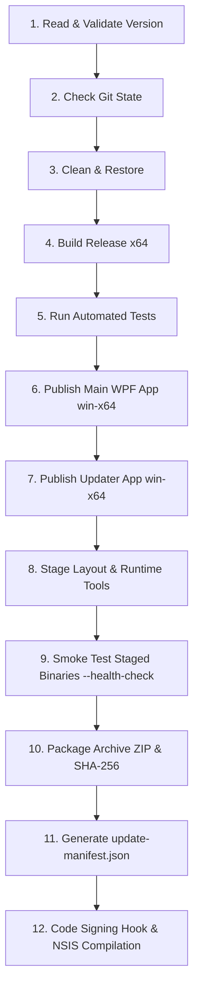
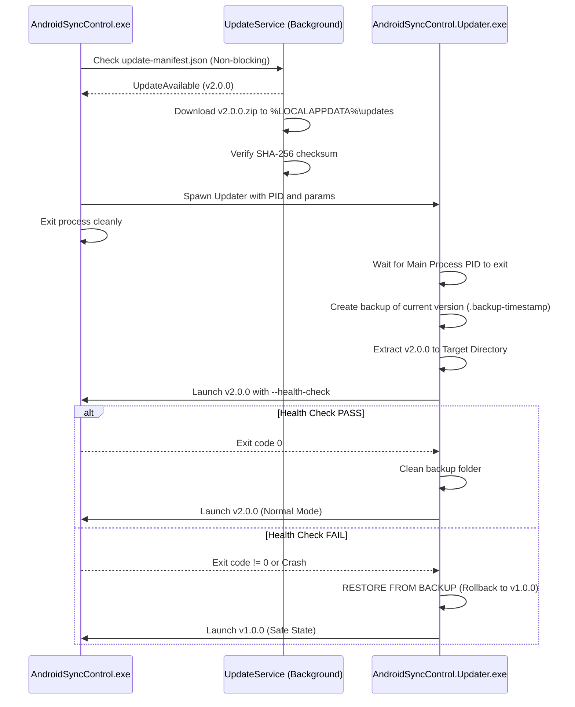
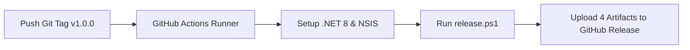

# 📦 Production Release & Update Architecture (AndroidSyncControl)

Tài liệu này đặc tả toàn bộ kiến trúc chuẩn hóa cho luồng **Đóng gói (Packaging & Release)** và luồng **Tự động Cập nhật (Auto-Update & Rollback)** của hệ thống AndroidSyncControl, bảo đảm tính ổn định cấp Production, an toàn dữ liệu và loại bỏ hoàn toàn các thành phần over-engineered.

---

## 1. 3 Vùng Dữ Liệu Tách Biệt (3-Tier Data Isolation)

Hệ thống tuân thủ nghiêm ngặt nguyên tắc **3-Tier Data Isolation** được định nghĩa tại [AppPaths.cs](file:///c:/Users/Phucx/Desktop/ROOT_Shopee/src/AndroidSyncControl/Infrastructure/AppPaths.cs). Dữ liệu được chia thành 3 vùng độc lập về vòng đời và quyền hạn:

```text
PROGRAM FILES (Read-Only Binaries)
C:\Program Files\AndroidSyncControl\
        │
        ├── AndroidSyncControl.exe
        ├── AndroidSyncControl.Updater.exe
        ├── *.dll
        ├── install.json
        └── Runtime/
            ├── adb/
            └── scrcpy/

USER DATA (Mutable User State)
%LOCALAPPDATA%\AndroidSyncControl\
        │
        ├── config/
        ├── logs/
        ├── cache/
        └── updates/

AGENT KNOWLEDGE (Persistent Historical Intelligence)
%LOCALAPPDATA%\AndroidSyncControl\agent-data\
        │
        ├── playbooks/
        ├── experiences/
        ├── lessons/
        └── evaluations/
```

> [!IMPORTANT]
> **INVARIANT BẤT BIẾN:** Installer ([setup.nsi](file:///c:/Users/Phucx/Desktop/ROOT_Shopee/installer/setup.nsi)) và Update Engine ([AndroidSyncControl.Updater](file:///c:/Users/Phucx/Desktop/ROOT_Shopee/src/AndroidSyncControl.Updater/UpdateEngine.cs)) **TUYỆT ĐỐI KHÔNG ĐƯỢC PHÉP XOÁ HOẶC GHI ĐÈ** thư mục `%LOCALAPPDATA%\AndroidSyncControl\agent-data\`. Toàn bộ Playbook, Experience và Lesson học được của Agent phải tồn tại vĩnh viễn qua mọi chu kỳ cài đặt và cập nhật.

---

## 2. Release Pipeline ([release.ps1](file:///c:/Users/Phucx/Desktop/ROOT_Shopee/scripts/build/release.ps1))

Entrypoint duy nhất cho toàn bộ quá trình đóng gói và phát hành:

```powershell
.\scripts\build\release.ps1 -Version 1.0.0 [-Channel stable]
```

### Flow Trình Tự 12 Bước Chuẩn Hóa



> [!NOTE]
> **Smoke Test trước khi Package:** Bản build staging bắt buộc phải chạy qua test kiểm tra tính toàn vẹn runtime (`--health-check`) trước khi được nén thành `.zip` và biên dịch NSIS Installer. Nếu app staging không pass health check, pipeline lập tức hủy bỏ.

---

## 3. Kiến Trúc Bảo Vệ Tính Toàn Vẹn Thực Tế (Pragmatic Integrity)

Loại bỏ toàn bộ kỹ thuật Anti-Tamper rườm rà (IAT scanning, memory text patching scan, CPUID VM detection, RDTSC timer checking) để phòng ngừa triệt để lỗi False Positive, crash trên máy user và xung đột với phần mềm EDR/Antivirus.

Thay vào đó, hệ thống tập trung vào **4 Trụ Cột Toàn Vẹn Thực Tế**:
1. **Authenticode Code Signing Hook:** Ký số toàn bộ `.exe` và `.dll` bằng chứng chỉ hợp lệ (`$env:SIGNING_CERT_PATH`).
2. **Update Checksum Verification:** [UpdateService.cs](file:///c:/Users/Phucx/Desktop/ROOT_Shopee/src/AndroidSyncControl/Update/UpdateService.cs) đối chiếu chuỗi mã băm SHA-256 của file `.zip` tải về với hash trong `update-manifest.json` trước khi khởi chạy Updater.
3. **Installation Metadata Validation:** [App.xaml.cs](file:///c:/Users/Phucx/Desktop/ROOT_Shopee/src/AndroidSyncControl/App.xaml.cs) kiểm tra tệp `install.json` và quyền ghi trên thư mục `%LOCALAPPDATA%` ngay khi khởi động.
4. **Manifest Schema Integrity:** [ManifestTests.cs](file:///c:/Users/Phucx/Desktop/ROOT_Shopee/tests/AndroidSyncControl.Tests/ManifestTests.cs) bảo đảm cấu trúc JSON manifest tương thích ngược và nhất quán giữa client và server.

```text
Application Startup
        ↓
Initialize %LOCALAPPDATA% directories (AppPaths.EnsureDirectories)
        ↓
Validate installation metadata (install.json) & write permissions
        ↓
[OK]  → Render UI immediately / Start background update check
[FAIL] → Log fatal error / Guide user repair
```

---

## 4. Đặc Tả Schema `update-manifest.json`

Manifest phục vụ cơ chế update qua CDN hoặc GitHub Releases:

```json
{
  "schemaVersion": 1,
  "product": "AndroidSyncControl",
  "version": "1.0.0",
  "channel": "stable",
  "platform": "win-x64",
  "mandatory": false,
  "package": {
    "url": "https://github.com/Phuc710/AndroidSyncControl/releases/download/v1.0.0/AndroidSyncControl-1.0.0-win-x64.zip",
    "size": 84122711,
    "sha256": "4b68e9f20dd39e6a9f5d179dc41d4c20fce8b3353dbde5a8947cf6551bca3a92"
  },
  "release": {
    "publishedAt": "2026-09-23T09:00:00Z",
    "changelog": [
      "Production packaging pipeline release v1.0.0",
      "Independent rollback-capable update engine (AndroidSyncControl.Updater)",
      "3-tier persistent data isolation (App vs LocalAppData vs Agent-Data)",
      "Universal Android mirroring and automated bypass engine"
    ]
  },
  "minimumSupportedVersion": "1.0.0"
}
```

### Chiến Lược Đóng Gói
- **V1 (Hiện tại):** Chỉ hỗ trợ **Full Package** (đơn giản, ổn định tuyệt đối, không phát sinh lỗi patching diff).
- **V2 (Future):** Hỗ trợ Delta Update sau khi Update Engine đạt độ ổn định cao qua nhiều chu kỳ phát hành.

---

## 5. Kiến Trúc Updater Độc Lập & Cơ Chế Rollback

Cơ chế cập nhật được vận hành bởi tiến trình độc lập [AndroidSyncControl.Updater.exe](file:///c:/Users/Phucx/Desktop/ROOT_Shopee/src/AndroidSyncControl.Updater/Program.cs) nhằm tránh xung đột khóa file (file-locking) trên Windows:



### Xử Lý Chi Tiết Tại [UpdateEngine.cs](file:///c:/Users/Phucx/Desktop/ROOT_Shopee/src/AndroidSyncControl.Updater/UpdateEngine.cs)
1. **WaitForParentExit:** Chờ tiến trình chính thoát hẳn (timeout 15s, buộc force kill nếu kẹt).
2. **CreateBackup:** Sao lưu toàn bộ binary hiện tại vào thư mục `.backup-<timestamp>` trong target dir.
3. **ApplyUpdate:** Giải nén tệp zip đè lên target dir.
4. **HealthCheck:** Khởi chạy `AndroidSyncControl.exe --health-check` và kiểm tra exit code.
5. **Rollback:** Nếu health check thất bại hoặc tiến trình crash, khôi phục nguyên trạng từ thư mục backup.

---

## 6. Khởi Động Ứng Dụng Không Block UI (Non-Blocking Startup)

Trong [App.xaml.cs](file:///c:/Users/Phucx/Desktop/ROOT_Shopee/src/AndroidSyncControl/App.xaml.cs), quy trình khởi động tách biệt hoàn toàn giữa việc nạp giao diện và kiểm tra update:

```text
Application Startup
        │
        ├── Handle CLI Arguments (--health-check -> Exit immediately with code 0)
        ├── AppPaths.EnsureDirectories()  (Tạo thư mục %LOCALAPPDATA% nếu chưa có)
        ├── ValidateInstallation()        (Kiểm tra install.json & quyền ghi)
        ├── LanguageManager.Apply()       (Nạp ngôn ngữ persisted)
        ├── MainWindow.Show()             (Hiển thị cửa sổ làm việc ngay lập tức)
        └── Task.Run(CheckForUpdates)     (Chạy ngầm sau 3s delay, không block UI)
```

Kiểm tra cập nhật ([UpdateService.cs](file:///c:/Users/Phucx/Desktop/ROOT_Shopee/src/AndroidSyncControl/Update/UpdateService.cs)) chạy ngầm hoàn toàn. Lỗi kết nối mạng, rớt CDN hay DNS không bao giờ làm gián đoạn việc mở ứng dụng.

---

## 7. NSIS Installer & Metadata `install.json`

### Layout Cài Đặt ([setup.nsi](file:///c:/Users/Phucx/Desktop/ROOT_Shopee/installer/setup.nsi))
- **Target:** `$PROGRAMFILES64\AndroidSyncControl` (yêu cầu quyền UAC Admin).
- Ghi đè binary, đăng ký Uninstaller trong Windows `Add/Remove Programs`.
- Tạo Start Menu và Desktop Shortcut.
- **Bảo toàn dữ liệu tuyệt đối:** Khi gỡ cài đặt (`uninstall.exe`), chỉ xoá thư mục `$INSTDIR` trong Program Files, **giữ nguyên 100% data người dùng và agent data tại `%LOCALAPPDATA%`**.

### Metadata File: `install.json`
Được sinh tại thư mục gốc của app sau khi build/stage ([InstallationMetadata.cs](file:///c:/Users/Phucx/Desktop/ROOT_Shopee/src/AndroidSyncControl/Infrastructure/InstallationMetadata.cs)):
```json
{
  "product": "AndroidSyncControl",
  "version": "1.0.0",
  "channel": "stable",
  "installPath": "C:\\Program Files\\AndroidSyncControl",
  "installedAt": "2026-09-23T09:00:00Z"
}
```

---

## 8. Release Artifacts & GitHub Actions CI/CD

Mỗi đợt phát hành tại thư mục `release/` sẽ bao gồm 4 artifact chuẩn:
1. `AndroidSyncControl-X.Y.Z-win-x64.zip` (Bản portable giải nén dùng ngay)
2. `AndroidSyncControl-X.Y.Z-Setup.exe` (Bản cài đặt 1-click NSIS)
3. `AndroidSyncControl-X.Y.Z-win-x64.sha256` (Mã băm SHA-256 đối soát)
4. `update-manifest.json` (Manifest cấp phát update)

### Workflow Tự Động Hóa ([release.yml](file:///c:/Users/Phucx/Desktop/ROOT_Shopee/.github/workflows/release.yml))


---

## 9. Ma Trận Phân Bổ Mức Độ Ưu Tiên (Implementation Status)

| Mức Độ | Trạng Thái | Thành Phần Kỹ Thuật Đã Triển Khai | Minh Chứng Triển Khai |
| :--- | :--- | :--- | :--- |
| **P0 (Packaging Core)** | ✅ **Đã hoàn thành 100%** | `VERSION`, csproj hardening, publish profiles, `AppPaths.cs`, `release.ps1`, unit tests, staging, SHA-256, NSIS installer. | [VERSION](file:///c:/Users/Phucx/Desktop/ROOT_Shopee/VERSION), [release.ps1](file:///c:/Users/Phucx/Desktop/ROOT_Shopee/scripts/build/release.ps1), [setup.nsi](file:///c:/Users/Phucx/Desktop/ROOT_Shopee/installer/setup.nsi) |
| **P1 (Update & Rollback)** | ✅ **Đã hoàn thành 100%** | `AndroidSyncControl.Updater`, manifest schema, update client, auto-backup, rollback, health check, 3-tier data isolation. | [UpdateEngine.cs](file:///c:/Users/Phucx/Desktop/ROOT_Shopee/src/AndroidSyncControl.Updater/UpdateEngine.cs), [UpdateService.cs](file:///c:/Users/Phucx/Desktop/ROOT_Shopee/src/AndroidSyncControl/Update/UpdateService.cs), [UpdateDialog.xaml](file:///c:/Users/Phucx/Desktop/ROOT_Shopee/src/AndroidSyncControl/UI/UpdateDialog.xaml) |
| **P2 (Integrity & CI/CD)** | ✅ **Đã hoàn thành 100%** | Code signing hook, package SHA-256 verification, `install.json` metadata validation, smoke test `--health-check`, GitHub Actions CI/CD. | [.github/workflows/release.yml](file:///c:/Users/Phucx/Desktop/ROOT_Shopee/.github/workflows/release.yml), [InstallationMetadataTests.cs](file:///c:/Users/Phucx/Desktop/ROOT_Shopee/tests/AndroidSyncControl.Tests/InstallationMetadataTests.cs) |
| **P3 (Future Optimization)** | ⏸️ Hoãn lại sau | Delta update (binary diffing), advanced background watchdog process, advanced telemetry. | Xem xét tại các phiên bản sau khi hệ thống đạt quy mô lớn. |
